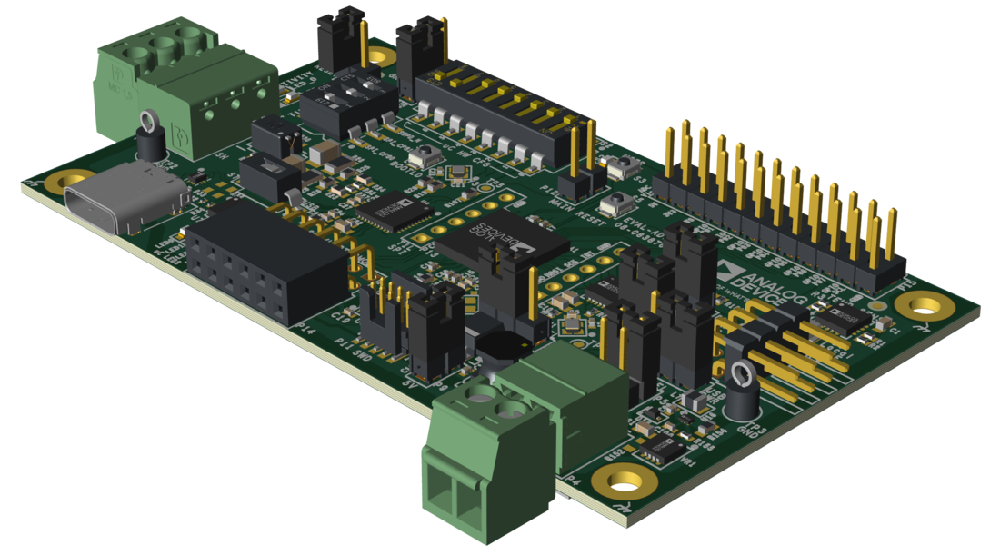

.. zephyr:board:: adi_eval_adin1140d1z

Overview
********

The EVAL-ADIN1140D1Z is an evaluation platform for the ADIN1140
10BASE-T1S MAC-PHY. It integrates an on-board Arm Cortex-M4 MAX32690 
microcontroller as the host and enables evaluation of a USB to 
10BASE-T1S bridge.

Hardware
********

- MAX32690 Arm Cortex-M4 host microcontroller
- ADIN1140 10BASE-T1S MAC-PHY (connected via SPI)
- ADIN1110 10BASE-T1L MAC-PHY (connected via SPI)

The ADIN1140 provides a 10BASE-T1S multidrop interface, while the ADIN1110
provides a 10BASE-T1L point-to-point interface. Both are robust, low power
Ethernet MAC-PHYs that connect to the MAX32690 host over SPI using the
Open Alliance TC6 (10BASE-T1x MAC-PHY Serial Interface) protocol. Together
they enable the board to perform 10BASE-T1S to 10BASE-T1L media conversion,
which will be supported in a future dedicated Zephyr sample.

Supported Features
==================

The ``adi_eval_adin1140d1z/max32690/m4`` board target supports the following
hardware features:

+-----------+------------+-------------------------------------+
| Interface | Controller | Driver/Component                    |
+===========+============+=====================================+
| GPIO      | on-chip    | gpio                                |
+-----------+------------+-------------------------------------+
| UART      | on-chip    | serial                              |
+-----------+------------+-------------------------------------+
| SPI       | on-chip    | spi                                 |
+-----------+------------+-------------------------------------+
| Ethernet  | ADIN1140   | 10BASE-T1S MAC-PHY (OA TC6 over SPI)|
+-----------+------------+-------------------------------------+
| Ethernet  | ADIN1110   | 10BASE-T1L MAC-PHY (OA TC6 over SPI)|
+-----------+------------+-------------------------------------+

Connections and IOs
===================

The MAX32690 host peripherals are connected to the on-board components as
described below. Pin names use the MAX32690 ``P<port>_<pin>`` notation.

Serial Console
--------------

The Zephyr console and shell are routed to ``UART0``, which is exposed through
the on-board USB-to-UART bridge. The default settings are 115200 8N1.

+-----------+-----------+-------------------------------------------------+
| Signal    | Pin       | Description                                     |
+===========+===========+=================================================+
| UART0 TX  | P2_12     | Console transmit (host to PC)                   |
+-----------+-----------+-------------------------------------------------+
| UART0 RX  | P2_11     | Console receive (PC to host)                    |
+-----------+-----------+-------------------------------------------------+

ADIN1140 (10BASE-T1S MAC-PHY)
-----------------------------

The ADIN1140 is connected to the MAX32690 ``SPI0`` bus (OA TC6).

+-----------+-----------+-------------------------------------------------+
| Signal    | Pin       | Description                                     |
+===========+===========+=================================================+
| SPI0 MOSI | P2_28     | Controller-out, PHY-in                          |
+-----------+-----------+-------------------------------------------------+
| SPI0 MISO | P2_27     | Controller-in, PHY-out                          |
+-----------+-----------+-------------------------------------------------+
| SPI0 SCK  | P2_29     | SPI clock                                       |
+-----------+-----------+-------------------------------------------------+
| SPI0 CS   | P2_26     | Chip select (active low)                        |
+-----------+-----------+-------------------------------------------------+
| INT       | P3_1      | Interrupt request to host (active low)          |
+-----------+-----------+-------------------------------------------------+
| WAKE      | P3_0      | Wake / power control (active high)              |
+-----------+-----------+-------------------------------------------------+

ADIN1110 (10BASE-T1L MAC-PHY)
-----------------------------

The ADIN1110 is connected to the MAX32690 ``SPI3`` bus (OA TC6).

+-----------+-----------+-------------------------------------------------+
| Signal    | Pin       | Description                                     |
+===========+===========+=================================================+
| SPI3 MOSI | P0_21     | Controller-out, PHY-in                          |
+-----------+-----------+-------------------------------------------------+
| SPI3 MISO | P0_20     | Controller-in, PHY-out                          |
+-----------+-----------+-------------------------------------------------+
| SPI3 SCK  | P0_16     | SPI clock                                       |
+-----------+-----------+-------------------------------------------------+
| SPI3 CS   | P0_19     | Chip select (active low)                        |
+-----------+-----------+-------------------------------------------------+
| INT       | P0_17     | Interrupt request to host (active low)          |
+-----------+-----------+-------------------------------------------------+
| RESET     | P0_15     | PHY reset (active low)                          |
+-----------+-----------+-------------------------------------------------+

Other Peripherals
-----------------

+-----------------+-----------+-----------------------------------------------+
| Component       | Bus / Pin | Description                                   |
+=================+===========+===============================================+
| ADT7420         | I2C1      | Ambient temperature sensor (addr ``0x48``),   |
|                 | 0x48      | SCL P0_12 / SDA P0_11                          |
+-----------------+-----------+-----------------------------------------------+
| AT24 EEPROM     | I2C0      | 64 KiB EEPROM (addr ``0x50``),                |
|                 | 0x50      | SCL P2_8 / SDA P2_7                            |
+-----------------+-----------+-----------------------------------------------+
| Pmod SPI        | SPI4      | Pmod connector: MOSI P1_1 / MISO P1_2 /       |
|                 |           | SCK P1_3 / CS P1_0                             |
+-----------------+-----------+-----------------------------------------------+
| USER LED        | P0_14     | User LED (``led0``, active low)               |
+-----------------+-----------+-----------------------------------------------+
| LED0..LED3      | P2_9,     | Status LEDs (active low): P2_9, P2_10,        |
|                 | P2_10,    | P1_9, P1_10                                    |
|                 | P1_9,     |                                               |
|                 | P1_10     |                                               |
+-----------------+-----------+-----------------------------------------------+
| USER BUTTON     | P0_13     | Push button S2 (``sw0``, active low)          |
+-----------------+-----------+-----------------------------------------------+

Programming and Debugging
*************************

.. zephyr:board-supported-runners::

Flashing
========

The MAX32690 MCU can be flashed by connecting an external debug probe to the
SWD port. SWD debug can be accessed through the Cortex 10-pin connector, P9.
Logic levels are either 1.8V or 3.3V (based on P3 selection).

Once the debug probe is connected to your host computer, then you can simply run the
``west flash`` command to write a firmware image into flash.

.. note::

   This board uses OpenOCD as the default debug interface. You can also use
   a Segger J-Link with Segger's native tooling by overriding the runner,
   appending ``--runner jlink`` to your ``west`` command(s). The J-Link should
   be connected to the standard 2*5 pin debug connector (P9) using an
   appropriate adapter board and cable.

Debugging
=========

Please refer to the `Flashing`_ section and run the ``west debug`` command
instead of ``west flash``.

References
**********

- `EVAL-ADIN1140D1Z product page
  <https://www.analog.com/en/resources/evaluation-hardware-and-software/evaluation-boards-kits/eval-adin1140d1z.html>`_
- `ADIN1140 product page
  <https://www.analog.com/en/products/adin1140.html>`_
- `ADIN1110 product page
  <https://www.analog.com/en/products/adin1110.html>`_
